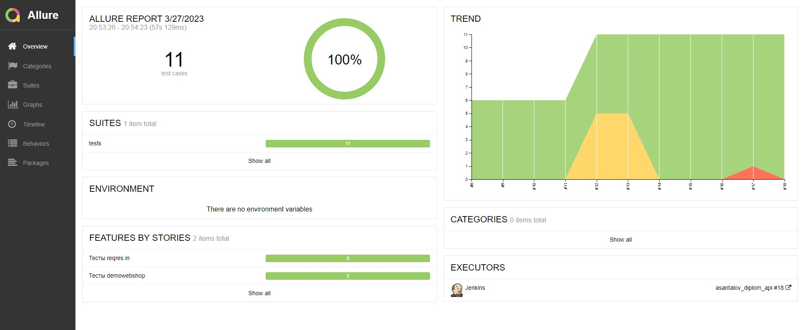
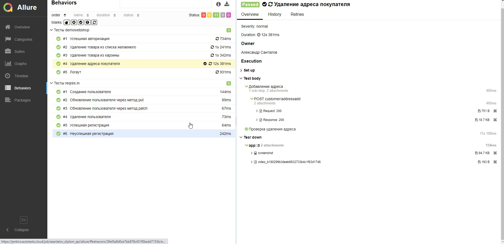
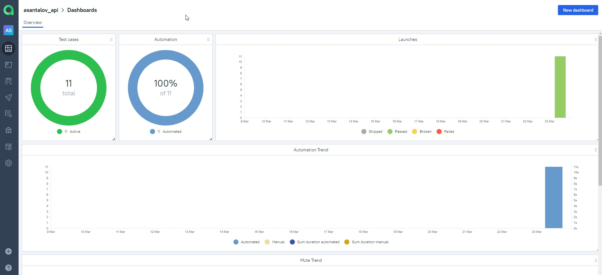
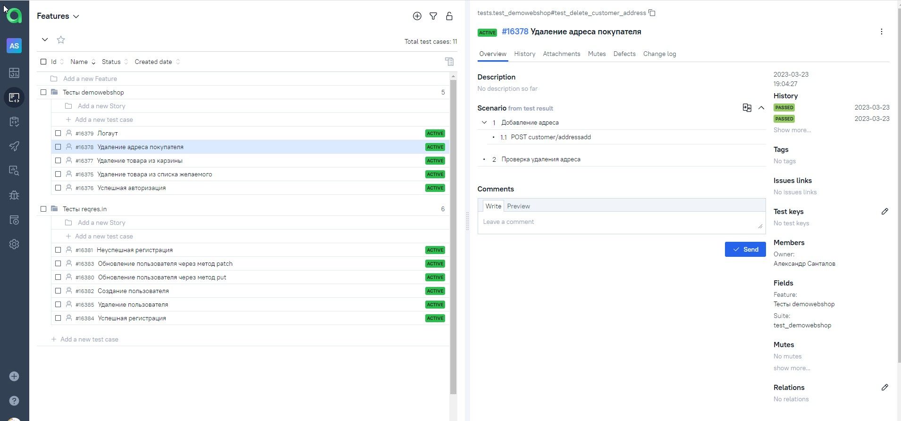
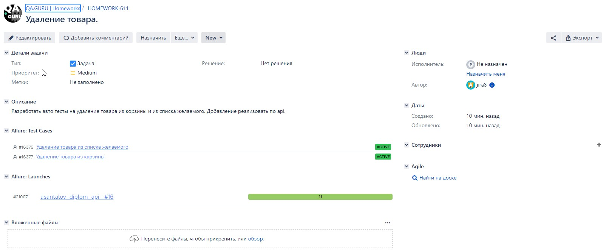
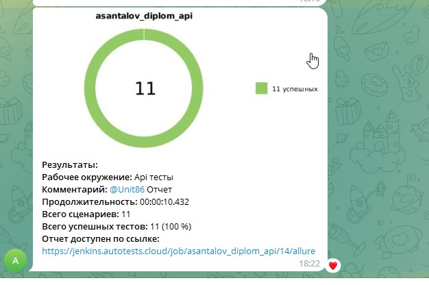

## Проект API автотестов
### Используемые технологии

<code></code>
<code></code>
<code></code>
<code></code>
<code></code>
<code></code>
<code></code>
<code></code>
<code></code>
<code></code>
<code></code>
<code></code>

  

### Проекст состоит из двух групп тестов:

<b>reqres.in - только api тесты</b>

<ul>
  <li>Создание пользователя</li>
  <li>Обновление пользователя через метод put</li>
  <li>Обновление пользователя через метод patch</li>
  <li>Удаление пользователя</li>
  <li>Успешная регистрация</li>
  <li>Неуспешная регистрация</li>
</ul>

<b>demowebshop - комбинированные ui\api тесты</b>

  
<ul>
  <li>Успешная авторизация</li>
  <li>Удаление товара из списка желаемого</li>
  <li>Удаление товара из карзины</li>
  <li>Удаление адреса покупателя</li>
  <li>Логаут</li>
</ul>

 

###  [Запуск проекта в Jenkins](https://jenkins.autotests.cloud/job/asantalov_diplom_api/)
##### При нажатии на "Собрать сейчас" начнется сборка тестов и их прохождение на сервере Jenkins.

###  Allure report
##### После прохождения тестов, результаты можно посмотреть в Allure отчете.

##### Во вкладке Behaviors находятся собранные тест кейсы, у которых описаны шаги. Для api методов реализованы вложения. Для комбинированных тестов по окончанию теста делается скриншот и сохраняется видеозапись теста.

##### Видео теста Удаления товара из карзины, добавление происходит по api, удаление через ui.

https://user-images.githubusercontent.com/87572795/228053887-4dfc4ce6-4ea3-478f-a074-fb8456706c94.mp4

###  [Интеграция с Allure TestOps](https://allure.autotests.cloud/project/2074/dashboards)

##### Так же вся отчетность сохраняется в Allure TestOps, где строятся аналогичные графики.

#### Во вкладке со сьютами, мы можем:
- Управлять всеми тест-кейсами или с каждым отдельно
- Перезапускать каждый тест отдельно от всех тестов
- Настроить интеграцию с Jira
- Добавлять ручные тесты и т.д

###  [Интеграция с Jira](https://jira.autotests.cloud/browse/HOMEWORK-611)
##### Настроив через Allure TestOps интеграцию с Jira, в тикет можно пробросить результат прохождение тестов и список тест-кейсов из Allure

###  Интеграция с Telegram
##### После прохождения тестов, в Telegram bot приходит сообщение с графиком и небольшой информацией о тестах.

